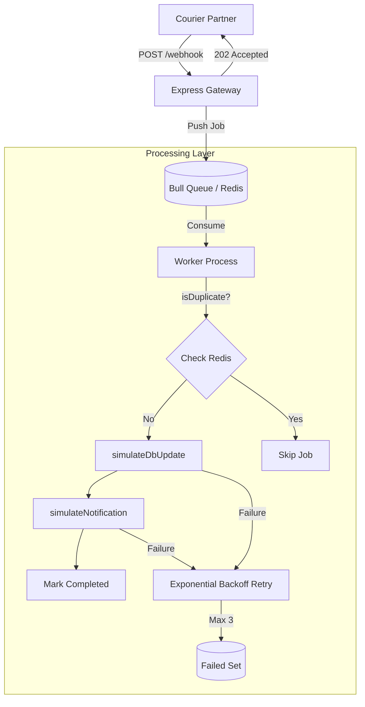

# 📦 Webhook Queue System

> A production-grade asynchronous webhook processing system built with Node.js, Express, Bull, and Redis. 🚀

[](https://nodejs.org/)
[](https://opensource.org/licenses/MIT)
[](https://redis.io/)

---

## 🌟 Overview

The **Webhook Queue System** is designed to handle high-frequency webhook events from external partners (like courier services). By decoupling the ingestion (HTTP) from the processing (Worker), we ensure that our gateway responds in **< 50ms**, regardless of how heavy the processing logic is.

### ✨ Key Features
- ⚡ **Lightning Fast Responses**: Acknowledgement (202 Accepted) in milliseconds.
- 🛡️ **Built-in Deduplication**: Prevents processing the same event multiple times within a 60s window using Redis `NX EX` logic.
- 🔄 **Smart Retries**: Automatic exponential backoff for failed jobs (max 3 attempts).
- 📊 **Real-time Monitoring**: Dedicated endpoint to track queue health (`waiting`, `active`, `completed`, `failed`).
- 👷 **Scalable Workers**: Run as many worker processes as needed to handle the load.

---

## 🏗️ Architecture

The system follows a **Producer-Consumer** pattern using a persistent message queue.



### ASCII Flow (The 50ms Boundary)
```text
Courier Partner
     │
     ▼
POST /webhook (Express) ──────┐
     │  responds 202 in <50ms │ <--- Gateway logic ends here
     ▼                        │
Bull Queue (Redis) <──────────┘
     │
     ▼
Worker Process (Separate)
     ├── isDuplicate? ──yes──► skip (log + return)
     │         no
     ▼
simulateDbUpdate()
     │
     ▼
simulateNotification()
     │
  success? ──no──► Bull retries (max 3, exponential backoff)
     │                    │
     │              all failed? ──► Bull failed set
     ▼
job.completed ✅
```

---

## 🚀 Getting Started

### 📋 Prerequisites
- **Node.js**: `v18+`
- **Redis**: Running locally on port `6379`

### 🛠️ Installation

1. **Clone the repository**
   ```bash
   git clone <repo-url>
   cd webhook-queue
   ```

2. **Install dependencies**
   ```bash
   npm install
   ```

3. **Configure environment**
   ```bash
   cp .env.example .env
   ```

---

## 🏃 Running the System

To see the magic happen, you need to run the **Gateway** and the **Worker** in separate terminals.

### 🌐 Terminal 1: The Gateway
```bash
npm start
# or for development
npm run dev:server
```

### 👷 Terminal 2: The Worker
```bash
npm run worker
# or for development
npm run dev:worker
```

---

## 🧪 Testing & Simulation

### 1. Send a Webhook
```bash
curl -X POST http://localhost:3000/webhook \
-H "Content-Type: application/json" \
-d '{
  "deliveryId": "DEL123",
  "status": "in_transit",
  "timestamp": "2024-03-20T10:00:00Z",
  "courierId": "FEDEX_001"
}'
```

### 2. Simulate Deduplication
Send the **exact same** request twice within 60 seconds.
- **First call**: Worker logs `Job fully processed`.
- **Second call**: Worker logs `Duplicate detected. Skipping`.

### 3. Simulate Retries
The simulation logic has a **15% failure rate**. Send multiple requests and watch the logs:
- `❌ Job failure (1/3)`
- `📦 Received Job ... (Attempt 2/3)`

### 4. Check Stats
```bash
curl http://localhost:3000/queue/stats
```

---

## ⚙️ Environment Variables

| Variable | Description | Default |
|----------|-------------|---------|
| `PORT` | HTTP Server Port | `3000` |
| `REDIS_HOST` | Redis Server Host | `127.0.0.1` |
| `REDIS_PORT` | Redis Server Port | `6379` |

---

## 🤝 Contributing
Please read [CONTRIBUTION.md](CONTRIBUTION.md) for details on our code of conduct and the process for submitting pull requests.

## 📄 License
This project is licensed under the MIT License - see the [LICENSE](LICENSE) file for details.

---
Built with ❤️ for High Performance Webhooks 🚀
